# EX:08 DATA VISUALIZATION

## AIM:
To Perform Data Visualization on a complex dataset and save the data to a file. 

## EXPLANATION:
Data visualization is the graphical representation of information and data. By using visual elements like charts, graphs, and maps, data visualization tools provide an accessible way to see and understand trends, outliers, and patterns in data.

## ALGORITHM:
### STEP 1
Read the given Data.
### STEP 2
Clean the Data Set using Data Cleaning Process.
### STEP 3
Use libraries like Seaborn and Matplotlib.
### STEP 4
Apply data visualization techniques to identify the patterns of the data.


## CODE:
```
import pandas as pd
import numpy as np
df=pd.read_csv("Superstore.csv")

df.head()

#Data Visualization using Seaborn

import seaborn as sns
from matplotlib import pyplot as plt

#1.Line plot

plt.figure(figsize=(8,5))
sns.lineplot(x="Segment",y="Region",data=df,marker='o')
plt.xticks(rotation = 90)
sns.lineplot(x='Ship Mode',y='Category', hue ="Segment",data=df)
sns.lineplot(x="Category",y="Sales",data=df,marker='o')

#2.Scatterplot

sns.scatterplot(x='Category',y='Sub-Category',data=df)
sns.scatterplot(x='Category', y='Sub-Category', hue ="Segment",data=df)
plt.figure(figsize=(10,7))
sns.scatterplot(x="Region",y="Sales",data=df)
plt.xticks(rotation = 90)

#3.Boxplot

sns.boxplot(x="Sub-Category",y="Discount",data=df)
sns.boxplot( x="Profit", y="Category",data=df)

#4.Violin Plot

sns.violinplot(x="Profit",data=df)

#5.Barplot

sns.barplot(x="Sub-Category",y="Sales",data=df)
plt.xticks(rotation = 90)
sns.barplot(x="Category",y="Sales",data=df)
plt.xticks(rotation = 90)

#6.Pointplot

sns.pointplot(x=df["Quantity"],y=df["Discount"])

#7.Count plot

sns.countplot(x="Category",data=df)
sns.countplot(x="Sub-Category",data=df)

#8.Histogram

sns.histplot(data=df,x ='Ship Mode',hue='Sub-Category')

#9.KDE Plot

sns.kdeplot(x="Profit", data = df,hue='Category')

#Data Visualization Using MatPlotlib

#1.Plot

plt.plot(df['Category'], df['Sales'])
plt.show()

#2.Heatmap

df.corr()
plt.subplots(figsize=(12,7))
sns.heatmap(df.corr(),annot=True)

<<<<<<< HEAD
#3.Piechart

df1=df.groupby(by=["Ship Mode"]).sum()
labels=[]
for i in df1.index:
    labels.append(i)
colors=sns.color_palette("bright")
plt.pie(df1["Sales"],labels=labels,autopct="%0.0f%%")
plt.show()

df3=df.groupby(by=["Category"]).sum()
labels=[]
for i in df3.index:
    labels.append(i) 
plt.figure(figsize=(8,8))
colors = sns.color_palette('pastel')
plt.pie(df3["Profit"],colors = colors,labels=labels, autopct = '%0.0f%%')
plt.show()

#4.Histogram
=======
#3.Histogram
>>>>>>> f350251af6b1677d40aa421a0d1927b739ec278c

plt.hist(df["Sub-Category"],facecolor="peru",edgecolor="blue",bins=10)
plt.show()

#4.Bargraph

plt.bar(df.index,df['Category'])
plt.show()

#5.Scatterplot

plt.scatter(df["Region"],df["Profit"], c ="blue")
plt.show()              

#6.Boxplot

plt.boxplot(x="Sales",data=df)
plt.show()
```
## OUTPUT:
### Reading the given dataset:
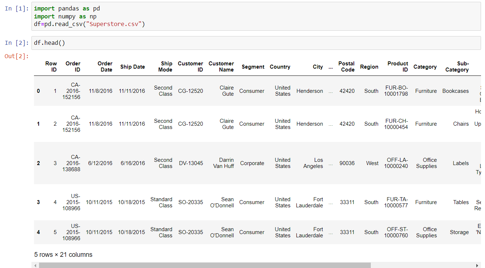
### Data Visualization Using Seaborn:
* 1.Lineplot
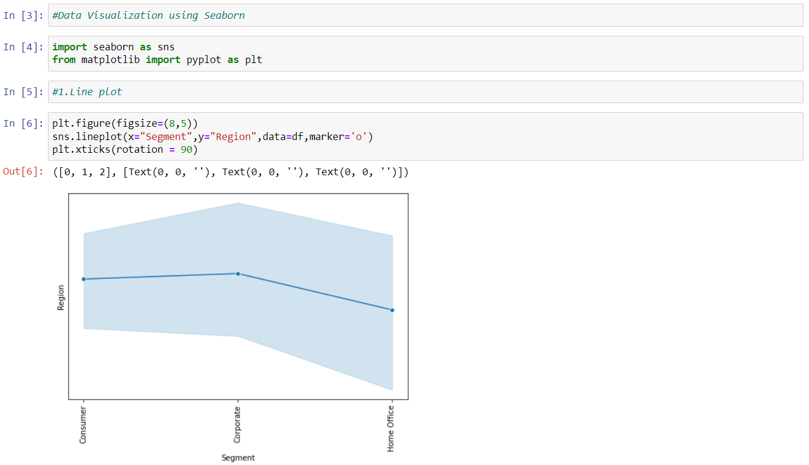
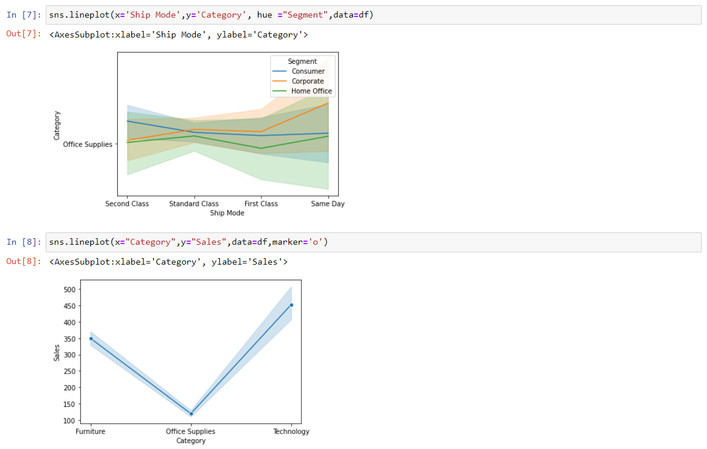
* 2.Scatterplot
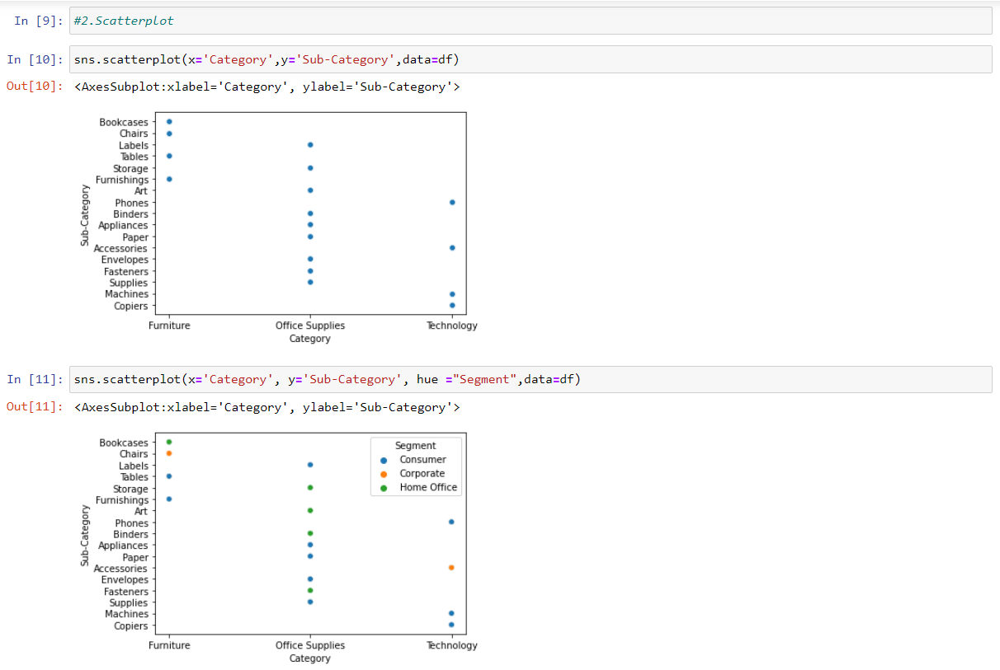
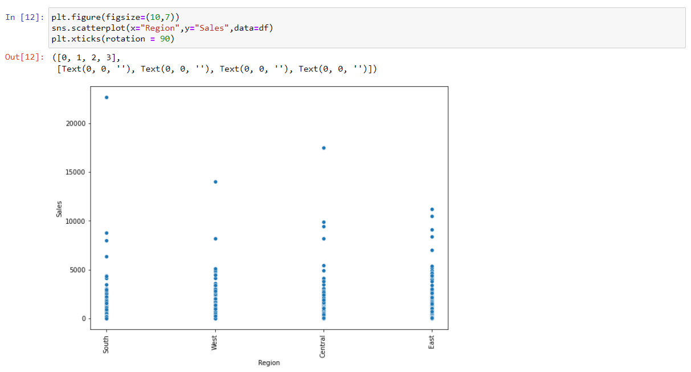
* 3.Boxplot
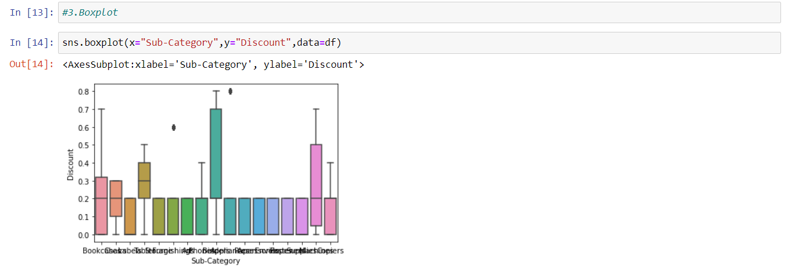
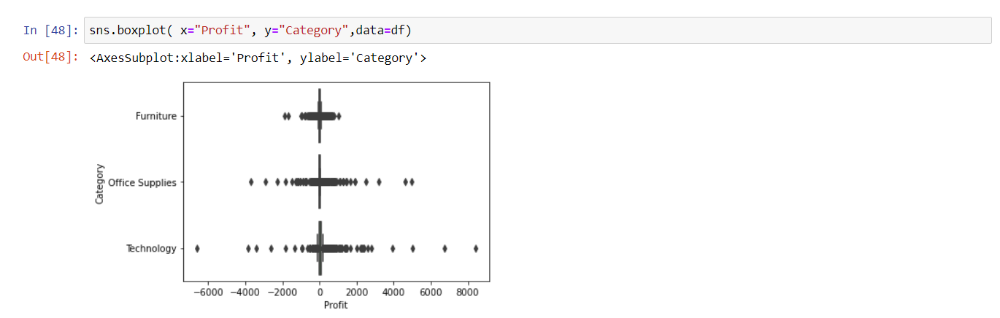
* 4.Violinplot
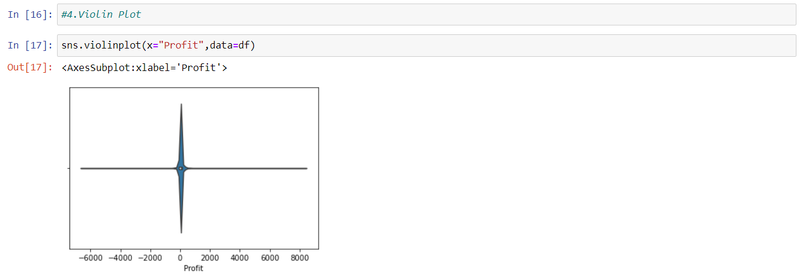
* 5.Barplot
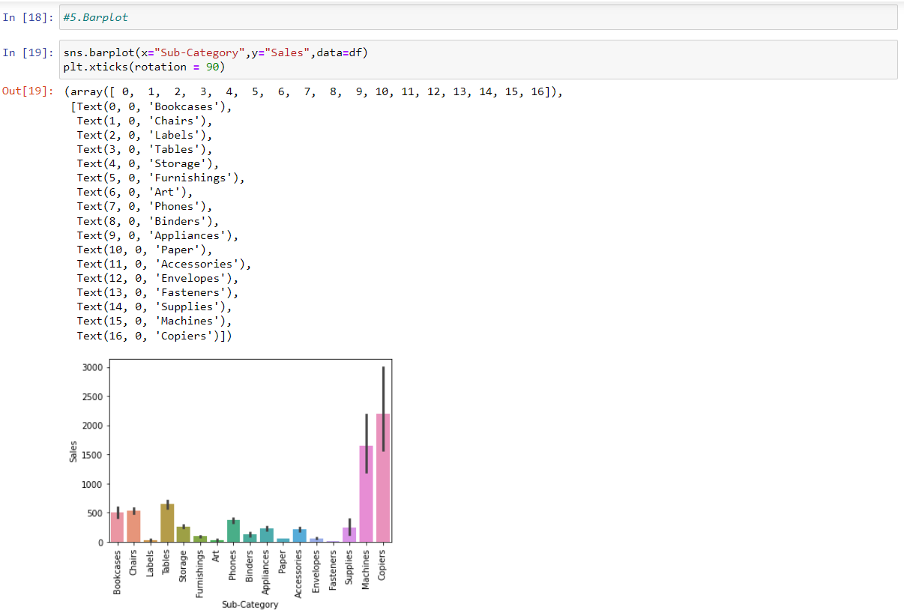

* 6.Pointplot
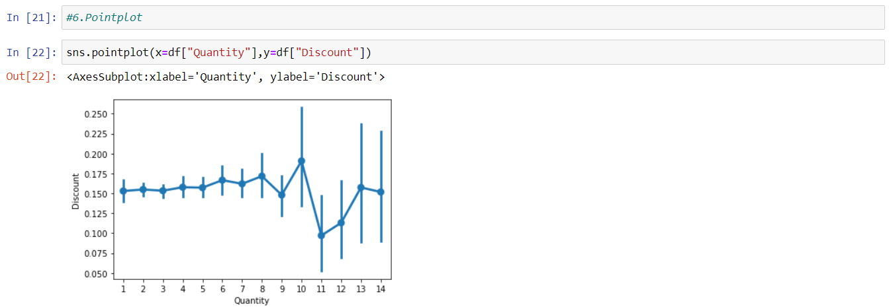
* 7.Countplot
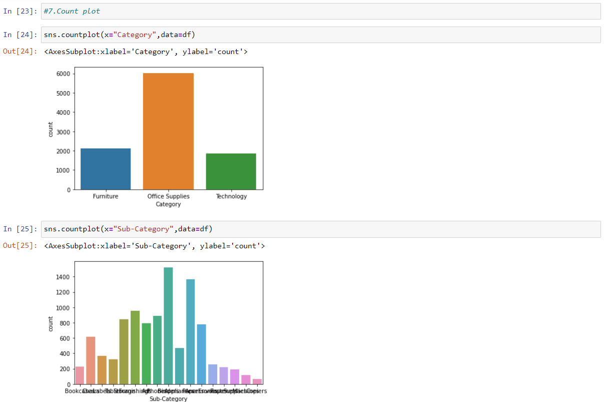
* 8.Histogram
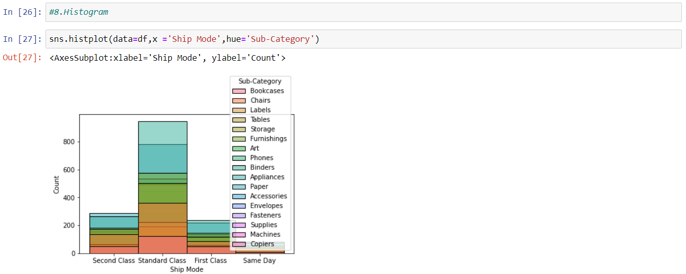
* 9.KDE Plot
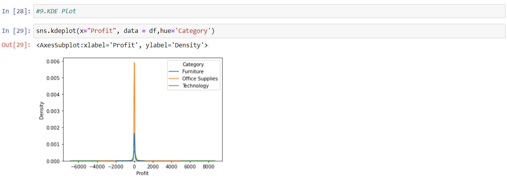
### Data Visualization Using Matplotlib:
* 1.Plot
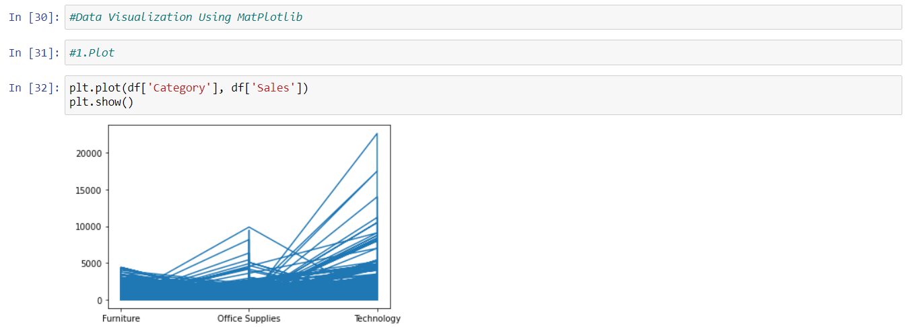
* 2.Heatmap
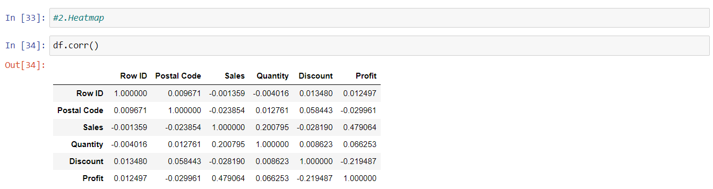
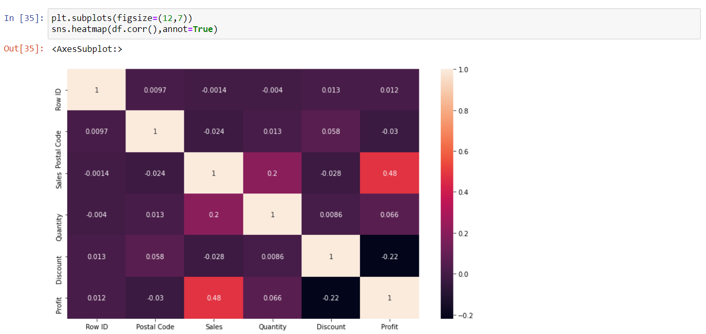
* 3.Histogram

* 4.Bargraph

* 5.Scatterplot
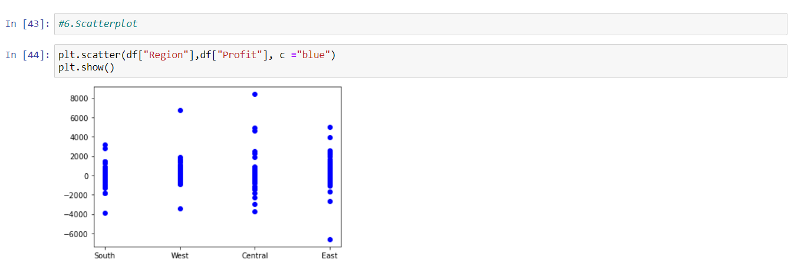
* 6.Boxplot
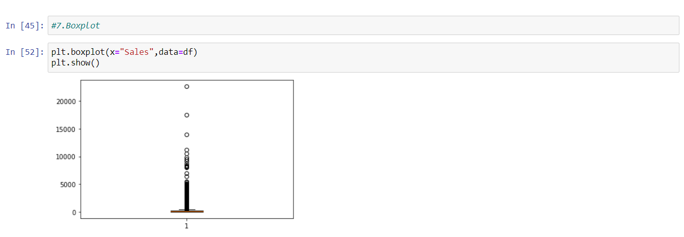

## RESULT:
Hence,Data Visualization is applied on the complex dataset using libraries like Seaborn and Matplotlib successfully and the data is saved to file.
